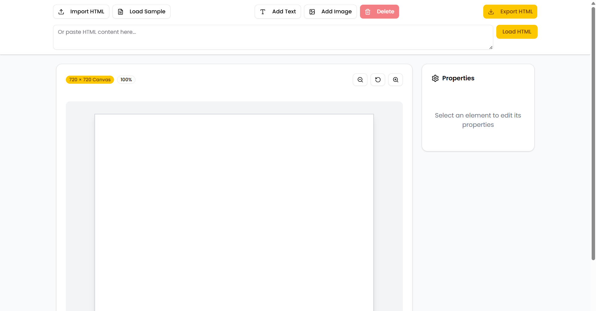

# Editable HTML Poster - Interactive Web Editor

A powerful, browser-based HTML editor that allows users to import existing HTML content and create interactive posters with drag-and-drop functionality. Built with Next.js, TypeScript, and Tailwind CSS.

## 📸 Screenshots


---


## 🚀 Features

- **HTML Import**: Load existing HTML files or paste HTML content directly
- **Visual Editor**: 720×720 canvas with real-time preview
- **Drag & Drop**: Move elements freely within canvas bounds
- **Property Editing**: Live property panel for styling and content modification
- **Element Management**: Add text and image elements dynamically
- **Export Functionality**: Download edited content as complete HTML files
- **Responsive Design**: Works seamlessly across different screen sizes
- **Zoom Controls**: Scale canvas view from 50% to 200%

## 🛠️ Setup Instructions

### Prerequisites

- Node.js 18.x or later
- npm or yarn package manager

### Installation

1. **Clone the repository**
   ```bash
   git clone <repository-url>
   cd editable-html-poster
   ```

2. **Install dependencies**
   ```bash
   npm install
   # or
   yarn install
   ```

3. **Run the development server**
   ```bash
   npm run dev
   # or
   yarn dev
   ```

4. **Open your browser**
   Navigate to `http://localhost:3000`

## 📁 Complete Project Structure

```
editable-html-poster/
├── 📁 app/
│   ├── favicon.ico
│   ├── globals.css              # Global styles and Tailwind imports
│   ├── layout.tsx               # Root layout component
│   └── page.tsx                 # Main application entry point
├── 📁 components/
│   ├── html-editor.tsx          # Core editor component (main functionality)
│   ├── mode-toggle.tsx          # Dark/light theme toggle
│   └── 📁 ui/                   # Reusable UI components
│       ├── badge.tsx            # Badge component for status indicators
│       ├── button.tsx           # Button component with variants
│       ├── card.tsx             # Card container component
│       ├── input.tsx            # Input field component
│       ├── label.tsx            # Form label component
│       └── textarea.tsx         # Multi-line text input component
├── 📁 lib/
│   └── utils.ts                 # Utility functions and helpers
├── 📁 types/
│   └── index.ts                 # TypeScript type definitions
├── 📁 screenshots/              # Application screenshots for README
│   ├── main-editor.png
│   ├── property-editing.png
│   └── import-export.png
├── 📁 public/                   # Static assets
│   ├── next.svg
│   └── vercel.svg
├── .eslintrc.json               # ESLint configuration
├── .gitignore                   # Git ignore rules
├── components.json              # shadcn/ui components configuration
├── next.config.js               # Next.js configuration
├── package.json                 # Dependencies and scripts
├── package-lock.json            # Lockfile for exact dependency versions
├── postcss.config.js            # PostCSS configuration for Tailwind
├── README.md                    # Project documentation (this file)
├── tailwind.config.ts           # Tailwind CSS configuration
└── tsconfig.json                # TypeScript configuration
```

## 🏗️ Architecture & SOLID Design Principles

### Component Architecture

The application follows a **modular component-based architecture** with clear separation of concerns:

#### Single Responsibility Principle (SRP)
- **HTMLEditor**: Main orchestrator handling only editor state and coordination
- **UI Components**: Each button, input, and card has a single, well-defined purpose
- **Event Handlers**: Separated into specific functions (drag, selection, property updates)

#### Open/Closed Principle (OCP)
- **Extensible Design**: New element types can be added without modifying existing code
- **Plugin Architecture**: Property editors are contextual and can be extended for new element types
- **Configurable Canvas**: Canvas dimensions and zoom levels are easily configurable

#### Liskov Substitution Principle (LSP)
- **Consistent Interfaces**: All DOM elements are treated uniformly through HTMLElement interface
- **Polymorphic Behavior**: Text and image elements share common selection/drag behaviors

#### Interface Segregation Principle (ISP)
- **Focused Interfaces**: Separate handlers for different interaction types (click, drag, keyboard)
- **Minimal Dependencies**: Components only depend on the specific props they need

#### Dependency Inversion Principle (DIP)
- **React Hooks**: State management abstracted through React's built-in hooks
- **Event System**: DOM manipulation abstracted through React's synthetic event system
- **Type Safety**: TypeScript interfaces define contracts rather than concrete implementations

### Key Architectural Decisions

1. **Direct DOM Manipulation**: Chosen for real-time performance and simplicity over complex virtual DOM diffing
2. **Event-Driven Design**: User interactions trigger specific, isolated event handlers
3. **Immutable State Updates**: React state updates follow immutable patterns for predictability
4. **Separation of Concerns**: UI rendering, state management, and business logic are clearly separated

### Design Patterns Used

- **Observer Pattern**: React's state management and re-rendering system
- **Command Pattern**: User actions (add, delete, modify) are encapsulated as discrete operations
- **Factory Pattern**: Dynamic element creation based on type (text vs image)
- **Composite Pattern**: Canvas contains multiple elements with uniform interface

## 🔧 Core Functionality

### 1. HTML Import System
```typescript
// Supports both file upload and direct HTML input
const loadHTML = (html: string) => {
  // Parse and sanitize HTML content
  // Extract elements and setup interactions
  // Render in canvas with proper bounds
}
```

### 2. Element Interaction System
```typescript
// Unified selection and manipulation
const selectElement = (element: HTMLElement) => {
  // Visual feedback with outline
  // Property panel updates
  // Keyboard shortcut activation
}
```

### 3. Real-time Property Editing
```typescript
// Immediate visual feedback
const updateElementProperty = (property: string, value: string) => {
  // Direct DOM manipulation for performance
  // Type-safe property updates
  // Contextual property panels
}
```

## 🚨 Known Limitations

### Current Limitations

1. **CSS Styling**: 
   - External stylesheets are not fully preserved during import
   - Only inline styles are reliably editable
   - Complex CSS selectors may not work as expected

2. **Element Types**: 
   - Limited to text elements and images
   - No support for complex HTML structures (forms, tables, etc.)
   - SVG elements have limited support

3. **Browser Compatibility**:
   - Modern browsers only (ES6+ features)
   - File API required for HTML import functionality
   - CSS Grid/Flexbox required for layout

4. **Performance**:
   - Large HTML files (>1MB) may cause performance issues
   - No virtualization for large numbers of elements
   - Memory usage grows with canvas complexity

5. **Export Functionality**:
   - Generated HTML may not be pixel-perfect match to canvas
   - Limited cross-browser compatibility testing
   - No minification or optimization of exported code

## 🚀 Potential Improvements

### Short-term Enhancements

1. **Enhanced Element Support**
   ```typescript
   // Add support for more HTML elements
   - Tables and forms
   - Video and audio elements
   - Custom HTML components
   - SVG drawing tools
   ```

2. **Advanced Styling**
   ```typescript
   // Improved CSS handling
   - External stylesheet preservation
   - CSS class management
   - Advanced typography controls
   - Animation support
   ```

3. **User Experience**
   ```typescript
   // Better interaction patterns
   - Multi-select functionality
   - Copy/paste operations
   - Undo/redo system
   - Keyboard shortcuts expansion
   ```

### Long-term Roadmap

1. **Collaboration Features**
   - Real-time multi-user editing
   - Version control system
   - Comment and review system
   - Template sharing

2. **Performance Optimization**
   - Virtual scrolling for large canvases
   - Web Workers for heavy operations
   - Canvas-based rendering option
   - Progressive loading

3. **Advanced Export Options**
   - PDF generation
   - Image export (PNG/JPEG)
   - Responsive HTML templates
   - Print-optimized layouts

4. **Integration Capabilities**
   - CMS integration
   - API for headless usage
   - Plugin system
   - Third-party service connections

## 🎥 Demo Features

### Key Interactions Demonstrated

1. **Import & Load**: Drag HTML file or paste content
2. **Element Selection**: Click any element to see blue outline
3. **Drag & Drop**: Move elements within 720×720 canvas bounds
4. **Property Editing**: 
   - Text content, font size, and color for text elements
   - Image URL, alt text, and dimensions for images
5. **Add Elements**: Create new text and image elements
6. **Delete Elements**: Select and press Delete key or use button
7. **Export**: Download complete HTML file with all modifications
8. **Zoom Controls**: Scale view for detailed editing

### Sample Workflow

1. Click "Load Sample" to see pre-built poster
2. Select the title element and modify text content
3. Drag elements to new positions
4. Add new text element and customize properties
5. Export final result as HTML file

## 📝 Technical Stack

- **Framework**: Next.js 14 with App Router
- **Language**: TypeScript for type safety
- **Styling**: Tailwind CSS with custom components
- **Icons**: Lucide React icon library

## 🤝 Contributing

This project demonstrates modern React development practices and can serve as a foundation for more complex HTML editing applications. The modular architecture makes it easy to extend with additional features while maintaining code quality and performance.

---

**Built with attention to SOLID principles, modern React patterns, and user-centric design.**
